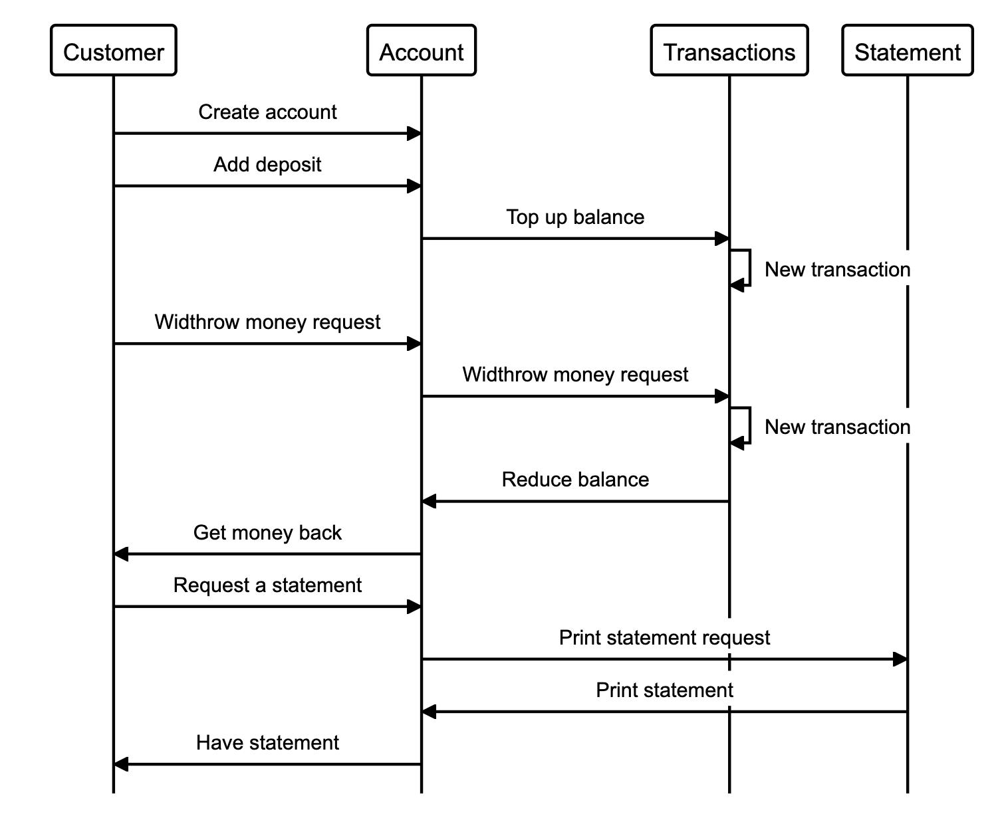

# bank_tech_test

### [Makers Academy](http://www.makersacademy.com) - Week 10 Solo Tech Test

### Acceptance criteria

**Given** a client makes a deposit of 1000 on 10-01-2012  
**And** a deposit of 2000 on 13-01-2012  
**And** a withdrawal of 500 on 14-01-2012  
**When** she prints her bank statement  
**Then** she would see

```
date || credit || debit || balance
14/01/2012 || || 500.00 || 2500.00
13/01/2012 || 2000.00 || || 3000.00
10/01/2012 || 1000.00 || || 1000.00
```

### User stories

```
As a customer
So I would like to keep my money in a safe place,
I would like to create a bank account.

As a customer
So I can view my stored funds,
I would like to be able to view my balance.

As a customer
So I can add money to my funds,
I would like to make deposits to my bank account.

As a customer
So I would like to spend my money in the supermarket,
I would like to be able to withdraw money from my account.

As a customer
So I can keep track of my spending,
I would like to view my bank statement and my transactions.
```
## Technologies

Language: Javascript, html, css

Test: Jasmine

## Sequence diagram


